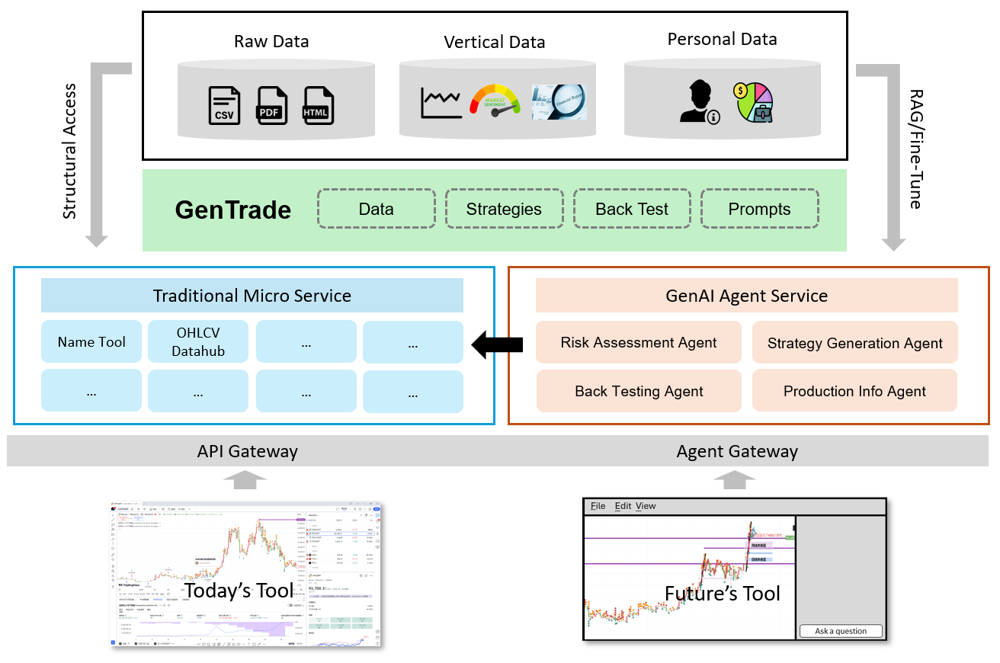

# Trust Investment Agent



## Agents

TBD

## Services

### OHLCV DataHub

```shell
# Pull image
docker pull registry.cn-hangzhou.aliyuncs.com/kenplusplus/tia_datahub

# Create .env file from .env_template

# Run OHLCV datahub service
docker run -p 8000:8000 \
    --env-file=.env -v <data folder>:/data \
    registry.cn-hangzhou.aliyuncs.com/kenplusplus/tia_datahub
```